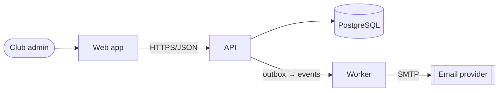

# Decision toolkit

## Contents

1. Quality-attribute scenarios
2. Option evaluation matrix
3. Back-of-envelope estimation
4. Build vs buy vs adopt
5. Deciding under uncertainty
6. C4 in brief

## 1 · Quality-attribute scenarios

"It must be scalable" cannot be evaluated. A scenario can:

| Part | Example |
|---|---|
| Source | 200 concurrent club admins |
| Stimulus | open the squad dashboard on match day |
| Environment | normal operation, one replica down |
| Response | dashboard renders with current data |
| Measure | p95 < 800 ms, error rate < 0.1 % |

Write three to five scenarios for the attributes that actually drive the decision
(performance, availability, modifiability, security, operability, cost). If the numbers are
unknown, write `unknown — measure X` rather than guessing.

## 2 · Option evaluation matrix

| | Option A | Option B | Do nothing |
|---|---|---|---|
| Scenario 1 (latency) | meets — measured in spike | likely — unmeasured | fails at ~2× load |
| Scenario 2 (new provider in 2 days) | yes, one adapter | no, core change | no |
| Cost to build | M | L | — |
| Cost to run (people, money, on-call) | +1 service | none | none |
| Reversibility | high — behind a port | low — schema + clients | — |
| Team familiarity | high | low | — |
| What it makes harder | cross-module queries | independent deploys | growth past N |
| Failure modes | queue backlog → delayed emails | cascading timeouts | — |

Weighting is a judgement — write the weights down so the reader can disagree with them
instead of with the conclusion.

## 3 · Back-of-envelope estimation

Orders of magnitude are enough to rule options in or out:

- Memory access ~100 ns · SSD random read ~0.1 ms · same-datacentre round trip ~0.5 ms ·
  same-region cross-zone ~1–2 ms · cross-continent round trip ~50–150 ms.
- A request that makes 10 sequential cross-service calls cannot be fast; parallelise or
  collapse them.
- Size the data: rows × row size × retention; index size roughly comparable to the indexed
  columns' size. Most "big data" is a few gigabytes that fits in one well-indexed database.
- Throughput: requests/day ÷ 86,400 × peak factor (often 5–10×) = peak rps.

Show the arithmetic in the ADR's Context so the next person can redo it with new numbers.

## 4 · Build vs buy vs adopt

Build when it is a differentiator you must control, or nothing available fits the forces.
Buy/adopt otherwise — then check:

- Total cost: licence + integration + operation + migration away later.
- Exit: data export, standard protocols, how much code would change if you left (keep it
  behind an adapter so the answer is "one module").
- Maturity: maintenance activity, release cadence, security track record, community,
  documentation.
- Fit: does it solve this problem, or a bigger adjacent one you'd have to operate anyway?
- Licence compatibility with how the product is distributed.
- Operability: who upgrades it, monitors it, and is paged for it?

## 5 · Deciding under uncertainty

- **Spike** the riskiest assumption with a time-boxed prototype that produces a number, then
  decide. A spike that does not produce evidence was a detour.
- **Last responsible moment** — defer a one-way decision until the cost of delay exceeds the
  value of the information you'd gain; make reversible decisions immediately.
- **Make it reversible** — an adapter/port around the uncertain choice often converts a
  one-way door into a two-way one cheaply.

## 6 · C4 in brief

- **Context** — the system as a box, its users and the external systems it talks to.
- **Container** — deployable/runnable units (web app, API, worker, database, queue) and how
  they communicate (protocol, sync/async).
- **Component** — the major parts inside one container; draw only for the area being changed.

